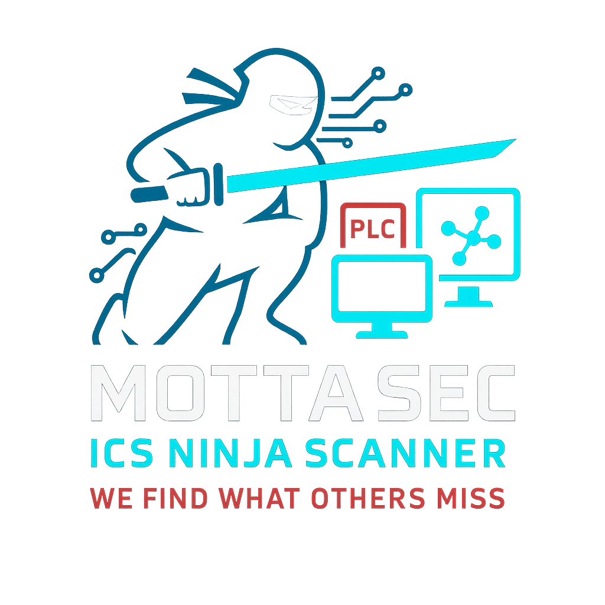

# ICS Ninja Scanner

<p align="center">

</p>

**Multi-protocol Industrial Control System security scanner.**

Detects misconfigurations, weak authentication, missing encryption, and security flaws across 11 ICS/SCADA protocols. Built for authorized security assessments of industrial environments.

> ⚖️ Licensed under [PolyForm Noncommercial 1.0.0](LICENSE) — free for research, education, and non-commercial use.

---

## Installation

```bash
# Core only (no protocol libraries)
pip install ics-ninja

# With all protocol libraries
pip install ics-ninja[all]

# Specific protocols only
pip install ics-ninja[modbus,s7,mqtt]

# Development
pip install ics-ninja[all,dev]
```

### Docker

```bash
docker build -t ics-ninja .
docker run --rm ics-ninja scan --target 192.168.1.100 --protocols modbus --intensity low
```

### From Source

```bash
git clone https://github.com/mottasec/ics-ninja-scanner.git
cd ics-ninja-scanner
pip install -e ".[all]"
```

## Quick Start

```bash
# Discover ICS devices on a subnet (passive, safe)
ics-ninja scan --target 192.168.1.0/24 --protocols all --intensity low

# Deep scan a specific PLC
ics-ninja scan --target 192.168.1.100 --protocols s7,modbus --intensity medium

# Full security assessment with rate limiting (for fragile devices)
ics-ninja scan --target 192.168.1.100 --protocols all --intensity high --rate-limit 500

# Export results
ics-ninja scan --target 192.168.1.0/24 --protocols all --intensity medium \
    --output-format json,html --output-file assessment_results
```

## Supported Protocols

| Protocol | Port | Description |
|----------|------|-------------|
| **Modbus TCP** | 502 | Device identification, register read/write, Modbus/TLS detection |
| **Siemens S7** | 102 | CPU state, module inventory, CVE checks, protection level analysis |
| **IEC 60870-5-104** | 2404 | Multi-station testing, IEC 62351 security detection |
| **MQTT** | 1883/8883 | Broker auth, v5 detection, WebSocket, QoS, topic access |
| **SNMP** | 161 | Community strings, SNMPv3 detection, BER-encoded walk |
| **OPC-UA** | 4840 | Security modes, anonymous access, certificate analysis, node browsing |
| **BACnet** | 47808 | WhoIs discovery, WriteProperty testing, device enumeration |
| **EtherNet/IP** | 44818 | CIP sessions, tag read/write, ForwardOpen, identity enumeration |
| **DNP3** | 20000 | Secure Authentication, control commands, outstation enumeration |
| **Profinet** | 34964 | DCP discovery, security class detection, RPC testing |
| **HART-IP** | 5094 | Session management, command enumeration, sub-device discovery |

## Scan Intensity Levels

| Level | What it does | Safe for production? |
|-------|-------------|---------------------|
| 🟢 **Low** | Passive discovery — version detection, banner grabbing, protocol fingerprinting | ✅ Yes |
| 🟡 **Medium** | Active queries — read registers, check auth, enumerate security settings | ⚠️ Generally safe |
| 🔴 **High** | Write tests — unauthenticated control attempts, write verification with auto-restore | ❌ Maintenance window only |

High-intensity scans prompt for confirmation before running. Write tests automatically restore original values.

## Rate Limiting

ICS devices can be fragile. Use `--rate-limit` to add delay between requests (in milliseconds):

```bash
ics-ninja scan --target 192.168.1.100 --protocols modbus --intensity medium --rate-limit 500
```

## Output Formats

- **TXT** — Human-readable terminal output
- **JSON** — Machine-parseable, for integration with other tools
- **CSV** — Spreadsheet-friendly
- **HTML** — Styled report for stakeholders

## CLI Reference

```
ics-ninja scan [OPTIONS]

Options:
  --target TEXT                    Target IP, range, or CIDR subnet  [required]
  --protocols TEXT                 Comma-separated protocols or 'all'  [required]
  --intensity [low|medium|high]   Scan intensity  [default: low]
  --output-format [txt|json|csv|html|all]  Output format  [default: txt]
  --output-file TEXT              Output filename (without extension)
  --rate-limit INTEGER            Delay between requests in ms
  --timeout INTEGER               Connection timeout in seconds  [default: 5]
  --threads INTEGER               Parallel scan threads  [default: 10]
  --no-verify                     Disable TLS verification
  --debug                         Enable debug logging

ics-ninja list                    List available protocols
ics-ninja version                 Show version
```

## Safety

This tool is for **authorized security assessments only**. Always:

1. 🔐 Get written authorization before scanning any ICS environment
2. 🟢 Start with low intensity in production
3. ⏰ Use maintenance windows for high-intensity scans
4. 📊 Monitor target systems during scanning
5. 🐌 Use `--rate-limit` for sensitive/legacy devices

## Contributing

We welcome contributions — especially new protocol scanners. See [CONTRIBUTING.md](CONTRIBUTING.md) for the dev setup, scanner checklist, and PR process.

## Security

Found a vulnerability in ICS Ninja Scanner itself? See [SECURITY.md](SECURITY.md) for responsible disclosure.

## License

[PolyForm Noncommercial License 1.0.0](LICENSE) — free for research, education, non-commercial organizations, and personal use. Commercial use requires a separate license from [MottaSec](https://mottasec.com).

---

Built by [MottaSec](https://mottasec.com)
